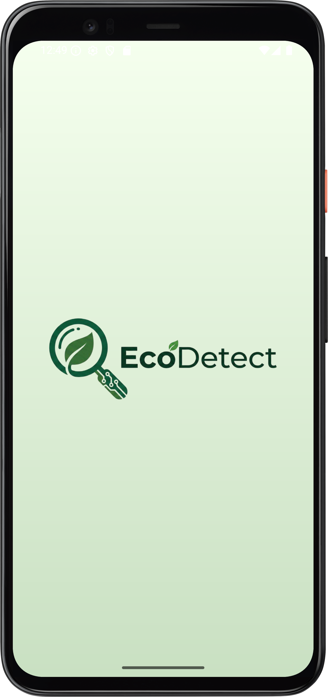
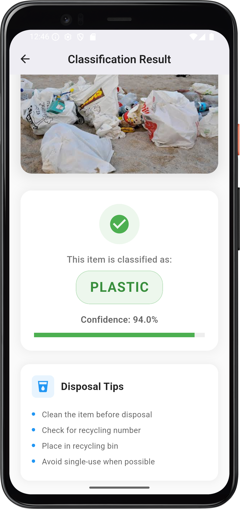
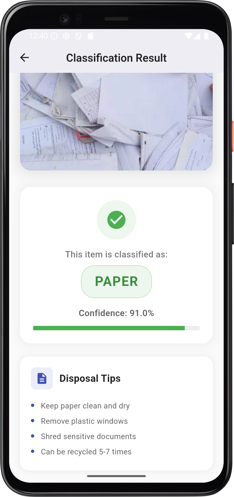
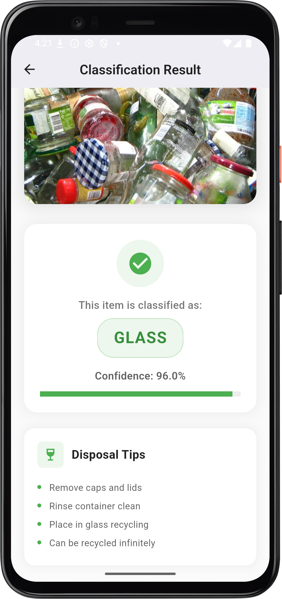
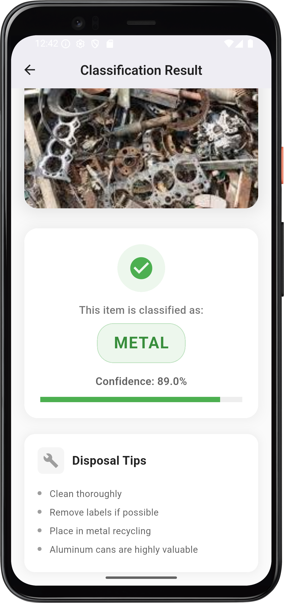
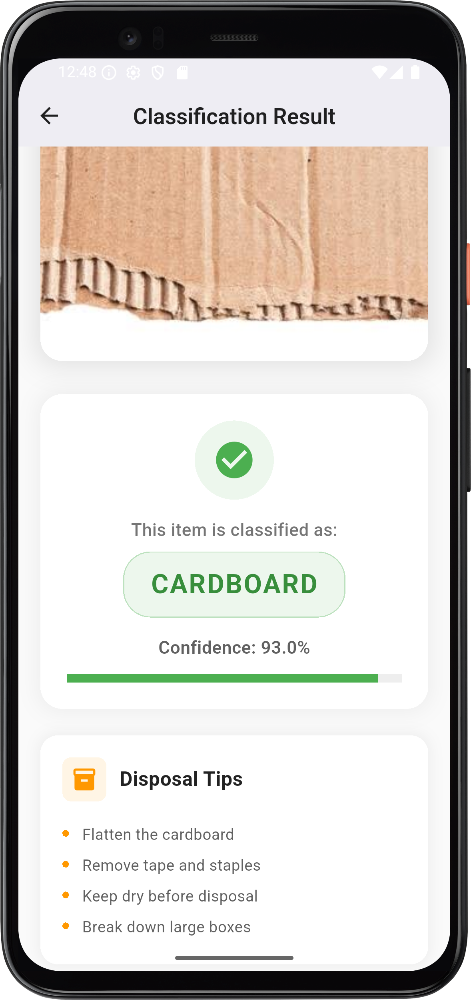
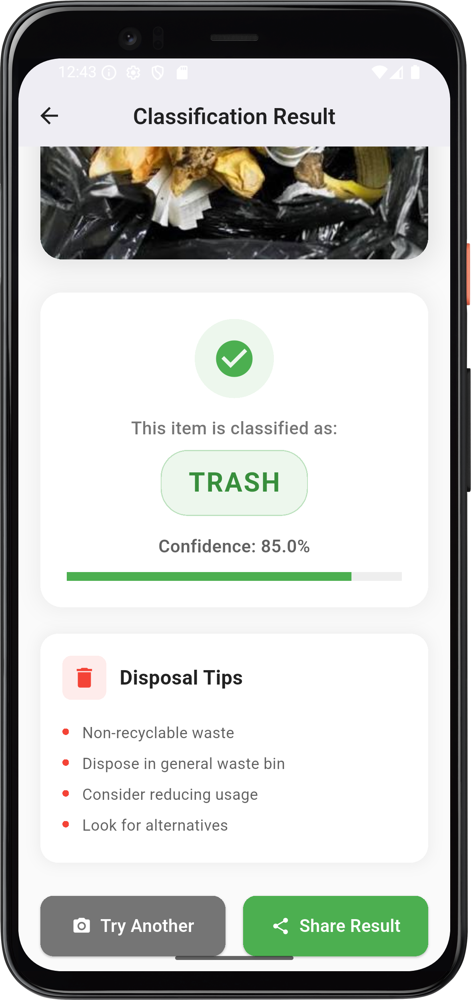
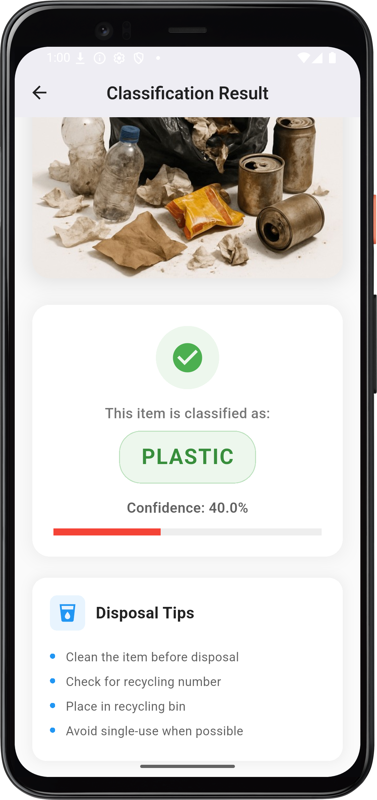

# 🌱 EcoDetect - AI Waste Classification App

An intelligent mobile application that uses AI to classify waste materials for proper recycling and environmental sustainability.

## 📱 Features

- **AI-Powered Classification**: Identifies 6 waste categories (Plastic, Paper, Glass, Metal, Cardboard, Trash)
- **Beautiful UI**: Modern, intuitive design with smooth animations
- **Image Selection**: Easy gallery integration for waste item photos
- **Confidence Scoring**: Shows classification confidence levels
- **Environmental Tips**: Provides disposal guidance for each waste type

## 🚀 Technology Stack

- **Frontend**: Flutter (Dart)
- **AI Model**: HuggingFace Integration (EfficientNetB0)
- **State Management**: Provider
- **Image Processing**: Image Picker

## 👥 Team

- Naba'a A. OuladYaich
- Fatmah Ahmed Al-Zahrani
- Renad Yasser Alansari
- Fidaa Osama Filamban
- Rawaa Majed Abdulhadi

## 🎓 Project

Umm-Alqura University  - AI3104T AI System Design Course
Supervisor: Dr. Omniah Nagoor

## 🛠️ Installation

1. Clone the repository
2. Run `flutter pub get`
3. Connect device/emulator
4. Run `flutter run`

## 📱 Screenshots

### Splash Screen

### Plastic Classification

### Paper Classification

### Glass Classification

### Metal Classification

### Cardboard Classification

### Trash Classification

### Trash (Alternative Case)

### Uncertain Result

